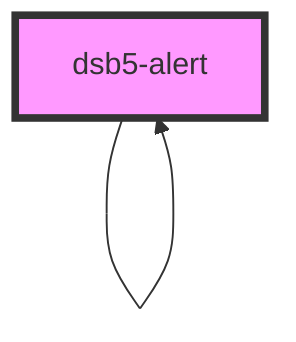

# 警告框

1. 警告及信息弹框，用于各种与用户交互的场景;
2. 也可以做特殊颜色的卡片展示

## 使用范例

### 基础示例

1. 就在当前展示区域展示
2. 可以用于颜色的卡片展示
   <dsb5-webcomponent-show>
   <dsb5-alert delay="0" content="这是一个默认的弹框" fixed="false"></dsb5-alert>
   <dsb5-alert delay="0" content="这是一个隐藏的弹框" fixed="false" show="false"></dsb5-alert>
   <dsb5-alert delay="0" content="这是一个成功的弹框" fixed="false" type="success" close="true"></dsb5-alert>
   <dsb5-alert delay="null" content="这是一个失败的弹框" fixed="false" type="danger"></dsb5-alert>
   <dsb5-alert delay="null" content="这是一个失败的弹框" fixed="false" type="danger">
   
这里是自定义内容

   </dsb5-alert>
   </dsb5-webcomponent-show>

### 弹框示例

1. 直接在 html 上展示
   <dsb5-webcomponent-show>
   <dsb5-alert delay="null" id="alertfixed_default" content="这是一个默认的弹框" show="false"></dsb5-alert>
   <dsb5-button style="width: 150px">
   点击开启
   <ds-script>
      $el.onclick = function(){
            const node = document.getElementById('alertfixed_default');
            node.show = !node.show;
            if(node.show) {
                $el.innerText = '点击关闭'  
            } else {
                $el.innerText = '点击开启'  
            }
      }
   </ds-script>
   </dsb5-button>
   </dsb5-webcomponent-show>

1. 点击，使用服务创建
   <dsb5-webcomponent-show>
   <dsb5-button style="width: 150px">
   显示弹框
   <ds-script>
      $el.onclick = function(){
         dsb5.dsb5Alert.showAlert({content: '测试弹框'}); 
      }
   </ds-script>
   </dsb5-webcomponent-show>

<!-- Auto Generated Below -->

## Properties

| Property               | Attribute | Description | Type                                                                                                                                                                                                                   | Default                 |
| ---------------------- | --------- | ----------- | ---------------------------------------------------------------------------------------------------------------------------------------------------------------------------------------------------------------------- | ----------------------- |
| `close`                | `close`   | 是否显示关闭按钮    | `boolean`                                                                                                                                                                                                              | `false`                 |
| `content` _(required)_ | `content` | 弹框的内容       | `string`                                                                                                                                                                                                               | `undefined`             |
| `delay`                | `delay`   | 延迟关闭        | `number`                                                                                                                                                                                                               | `3000`                  |
| `fixed`                | `fixed`   | 弹框是否是浮动的    | `boolean`                                                                                                                                                                                                              | `true`                  |
| `show`                 | `show`    | 是否显示        | `boolean`                                                                                                                                                                                                              | `true`                  |
| `type`                 | `type`    | 弹框的类型       | `ComponentType.danger \| ComponentType.dark \| ComponentType.empty \| ComponentType.info \| ComponentType.light \| ComponentType.primary \| ComponentType.secondary \| ComponentType.success \| ComponentType.warning` | `ComponentType.primary` |

## Events

| Event       | Description | Type                   |
| ----------- | ----------- | ---------------------- |
| `closeemit` | 弹框关闭事件      | `CustomEvent<boolean>` |

## Methods

### `showAlert(opt: { content: string; type?: ComponentType; close?: boolean; delay?: number; }) => Promise<void>`

显示弹框组件;
用法: dsb5.dsb5Alert.showAlert({content: '测试弹框'});

#### Returns

Type: `Promise<void>`

## Slots

| Slot        | Description |
| ----------- | ----------- |
| `"default"` | 展示的内容       |

## Dependencies

### Used by

 - [dsb5-alert](.)

### Depends on

- [dsb5-alert](.)

### Graph

----------------------------------------------

*Built with [StencilJS](https://stenciljs.com/)*
