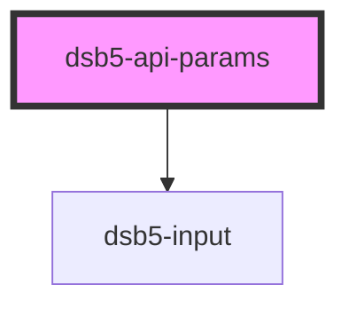

# 单列多行表单

<dsb5-webcomponent-show>
    <dsb5-api-params>
    <ds-script>
    console.log('---------------')
      $el.addEventListener('formchange', function(el){
        console.log(el.detail)
      })
   </ds-script>
    </dsb5-api-params>
</dsb5-webcomponent-show>

<!-- Auto Generated Below -->

## Properties

| Property | Attribute | Description | Type              | Default                                                                                                                                                                                           |
| -------- | --------- | ----------- | ----------------- | ------------------------------------------------------------------------------------------------------------------------------------------------------------------------------------------------- |
| `forms`  | --        | 表单结构        | `Dsb5FromModel[]` | `[     {       type: DataType.string,       name: 'key值',     },     {       type: DataType.string,       name: 'value值',     },     {       type: DataType.string,       name: '描述',     },   ]` |

## Events

| Event        | Description | Type                                                         |
| ------------ | ----------- | ------------------------------------------------------------ |
| `formchange` | 返回变更的数据     | `CustomEvent<{ valid: boolean; value: Dsb5FromModel[][]; }>` |

## Dependencies

### Depends on

- [dsb5-input](../dsb5-input)

### Graph

----------------------------------------------

*Built with [StencilJS](https://stenciljs.com/)*
