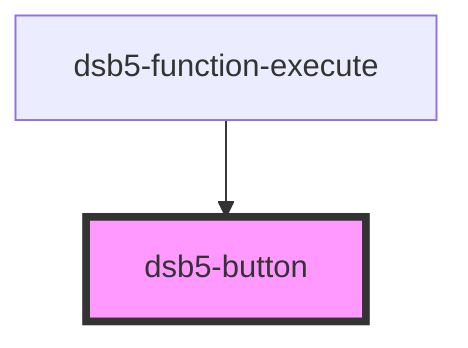

# 按钮

1. 基础按钮

## 使用范例

### 基础示例

1. 基础按钮
   <dsb5-webcomponent-show type="row">
   <dsb5-button class="mr_1">测试按钮</dsb5-button>
   <dsb5-button class="mr_1" type="success">测试按钮</dsb5-button>
   <dsb5-button class="mr_1" type="danger">测试按钮</dsb5-button>
   <dsb5-button class="mr_1" outline="true">测试按钮</dsb5-button>
   <dsb5-button class="mr_1" type="success" outline="true">测试按钮</dsb5-button>
   <dsb5-button type="danger" outline="true">测试按钮</dsb5-button>

   </dsb5-webcomponent-show>

<!-- Auto Generated Below -->

## Properties

| Property  | Attribute | Description | Type                                                                                                                                                                                            | Default                 |
| --------- | --------- | ----------- | ----------------------------------------------------------------------------------------------------------------------------------------------------------------------------------------------- | ----------------------- |
| `outline` | `outline` | 按钮outline类型 | `boolean`                                                                                                                                                                                       | `false`                 |
| `size`    | `size`    | 按钮大小        | `SizeType.lg \| SizeType.sm`                                                                                                                                                                    | `null`                  |
| `type`    | `type`    | 按钮的类型       | `ComponentType.danger \| ComponentType.dark \| ComponentType.info \| ComponentType.light \| ComponentType.primary \| ComponentType.secondary \| ComponentType.success \| ComponentType.warning` | `ComponentType.primary` |

## Slots

| Slot        | Description |
| ----------- | ----------- |
| `"default"` | 展示的内容       |

## Dependencies

### Used by

 - [dsb5-function-execute](../dsb5-function-execute)

### Graph

----------------------------------------------

*Built with [StencilJS](https://stenciljs.com/)*
