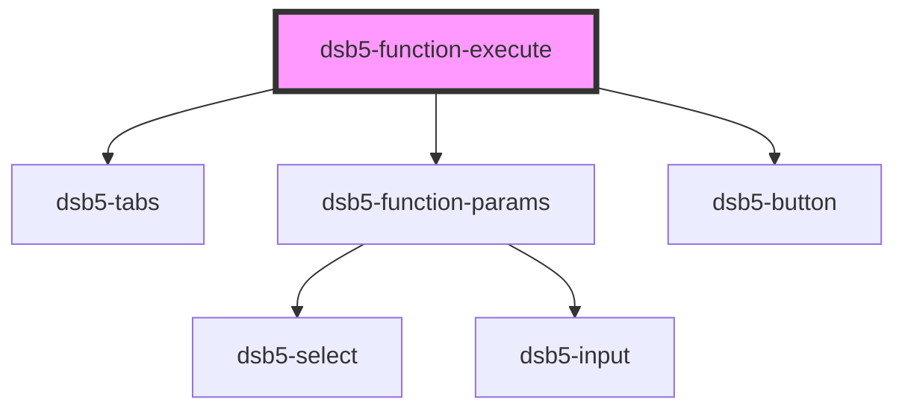

# 函数执行组件

文档功能组件，执行挂载在window下面的函数，展示执行结果和执行过程中的基础信息

## 基础用例类型

(type="testCase")仅使用折叠面板展示函数执行信息

### 示例

<dsb5-webcomponent-show>
<dsb5-function-execute fun="ds.tsetFun" time="1">   
    <ds-prop name="params" type="array">
       ["1"]
    </ds-prop>
    <ds-prop name="result" type="array">
       "1"
    </ds-prop>
</dsb5-function-execute>
<dsb5-function-execute fun="ds.tsetFun">   
    <ds-prop name="params" type="array">
      ["2"]
    </ds-prop>
    <ds-prop name="result" type="array">
      3
    </ds-prop>
</dsb5-function-execute>
</dsb5-webcomponent-show>

<!-- Auto Generated Below -->

## Properties

| Property           | Attribute | Description | Type     | Default     |
| ------------------ | --------- | ----------- | -------- | ----------- |
| `fun` _(required)_ | `fun`     | 需要执行的全局函数   | `string` | `undefined` |
| `params`           | --        | 需要执行函数的参数   | `any[]`  | `undefined` |
| `result`           | --        | 执行函数的结果     | `any[]`  | `undefined` |
| `time`             | `time`    | 执行次数        | `number` | `10`        |

## Dependencies

### Depends on

- [dsb5-tabs](../dsb5-tabs)
- [dsb5-function-params](../dsb5-function-params)
- [dsb5-button](../dsb5-button)

### Graph

----------------------------------------------

*Built with [StencilJS](https://stenciljs.com/)*
