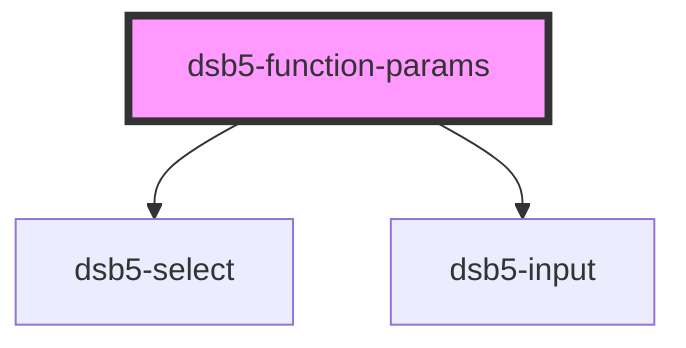

# 单列表单

<dsb5-webcomponent-show>
    <dsb5-function-params></dsb5-function-params>
</dsb5-webcomponent-show>

<!-- Auto Generated Below -->

## Events

| Event     | Description | Type                           |
| --------- | ----------- | ------------------------------ |
| `getData` | 返回变更的数据     | `CustomEvent<Dsb5FromModel[]>` |

## Dependencies

### Depends on

- [dsb5-select](../dsb5-select)
- [dsb5-input](../dsb5-input)

### Graph

----------------------------------------------

*Built with [StencilJS](https://stenciljs.com/)*
