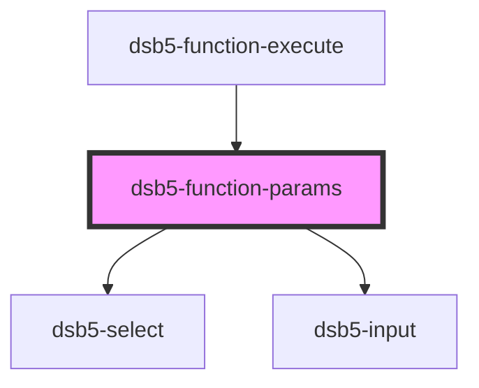

# 单列表单

<dsb5-webcomponent-show>
    <dsb5-function-params>
    <ds-script>
    console.log('---------------')
      $el.addEventListener('formchange', function(el){
        console.log(el.detail)
      })
   </ds-script>
    </dsb5-function-params>
</dsb5-webcomponent-show>

<!-- Auto Generated Below -->

## Events

| Event        | Description | Type                                                       |
| ------------ | ----------- | ---------------------------------------------------------- |
| `formchange` | 返回变更的数据     | `CustomEvent<{ valid: boolean; value: Dsb5FromModel[]; }>` |

## Dependencies

### Used by

 - [dsb5-function-execute](../dsb5-function-execute)

### Depends on

- [dsb5-select](../dsb5-select)
- [dsb5-input](../dsb5-input)

### Graph

----------------------------------------------

*Built with [StencilJS](https://stenciljs.com/)*
