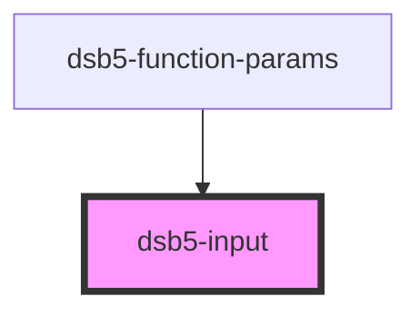

# 输入框

## 示例

1. 基础使用示例
<dsb5-webcomponent-show>
    <dsb5-input>
    </dsb5-input>
</dsb5-webcomponent-show>

<!-- Auto Generated Below -->

## Properties

| Property      | Attribute     | Description  | Type     | Default     |
| ------------- | ------------- | ------------ | -------- | ----------- |
| `placeholder` | `placeholder` | placeholder值 | `string` | `undefined` |

## Dependencies

### Used by

 - [dsb5-function-params](../dsb5-function-params)

### Graph

----------------------------------------------

*Built with [StencilJS](https://stenciljs.com/)*
