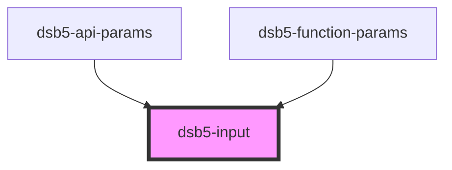

# 输入框

## 示例

1. 基础使用示例
   <dsb5-webcomponent-show>
   <dsb5-input>
   </dsb5-input>
   </dsb5-webcomponent-show>

2. 前后缀使用示例
   <dsb5-webcomponent-show>
   <dsb5-input>
   <dsb5-button slot="prefix">前缀</dsb5-button>
   <dsb5-button slot="suffix">后缀</dsb5-button>
   </dsb5-input>
   </dsb5-webcomponent-show>

<!-- Auto Generated Below -->

## Properties

| Property      | Attribute     | Description  | Type                         | Default     |
| ------------- | ------------- | ------------ | ---------------------------- | ----------- |
| `error`       | `error`       | 是否是错误        | `boolean`                    | `undefined` |
| `placeholder` | `placeholder` | placeholder值 | `string`                     | `undefined` |
| `size`        | `size`        | 按钮大小         | `SizeType.lg \| SizeType.sm` | `null`      |
| `value`       | `value`       | 当前的值         | `string`                     | `null`      |

## Events

| Event         | Description | Type                  |
| ------------- | ----------- | --------------------- |
| `valuechange` | 值变化的事件      | `CustomEvent<string>` |

## Slots

| Slot       | Description |
| ---------- | ----------- |
| `"prefix"` | 前缀          |
| `"suffix"` | 后缀          |

## Dependencies

### Used by

 - [dsb5-api-params](../dsb5-api-params)
 - [dsb5-function-params](../dsb5-function-params)

### Graph

----------------------------------------------

*Built with [StencilJS](https://stenciljs.com/)*
