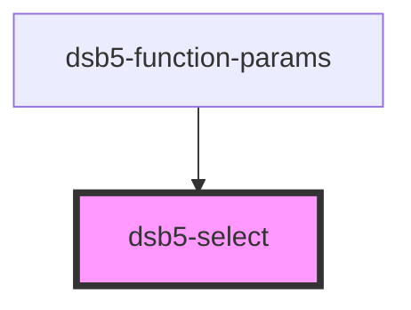

# 下拉列表

## 示例

1. 基础使用示例
<dsb5-webcomponent-show>
    <dsb5-select>
          <option  value="1">第一个</option>
          <option value="2">第二个</option>
          <option selected value="3">第三个</option>
          <option value="4">第四个</option>
    </dsb5-select>
</dsb5-webcomponent-show>

<!-- Auto Generated Below -->

## Properties

| Property | Attribute | Description | Type  | Default |
| -------- | --------- | ----------- | ----- | ------- |
| `value`  | `value`   | 当前的值        | `any` | `null`  |

## Events

| Event         | Description | Type               |
| ------------- | ----------- | ------------------ |
| `valuechange` | 值变化的事件      | `CustomEvent<any>` |

## Dependencies

### Used by

 - [dsb5-function-params](../dsb5-function-params)

### Graph

----------------------------------------------

*Built with [StencilJS](https://stenciljs.com/)*
