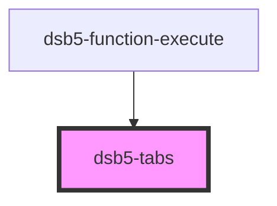

# tab 组件

标签导航组件

### 基础示例

1. 仅仅用于切换展示
2. 不涉及其他如缓存等任何功能的tab切换
<dsb5-webcomponent-show>
  <dsb5-tabs>
    <ds-prop name="tabs" type="array">
       ["第一个tab", "第二个tab"]
    </ds-prop>
    

      第二个tab，第二个tab，第二个tab，第二个tab
    

    

      第一个tab，第一个tab，第一个tab，第一个tab
    

  </dsb5-tabs>
</dsb5-webcomponent-show>

<!-- Auto Generated Below -->

## Properties

| Property | Attribute | Description | Type       | Default |
| -------- | --------- | ----------- | ---------- | ------- |
| `tabs`   | --        |             | `string[]` | `[]`    |

## Dependencies

### Used by

 - [dsb5-function-execute](../dsb5-function-execute)

### Graph

----------------------------------------------

*Built with [StencilJS](https://stenciljs.com/)*
