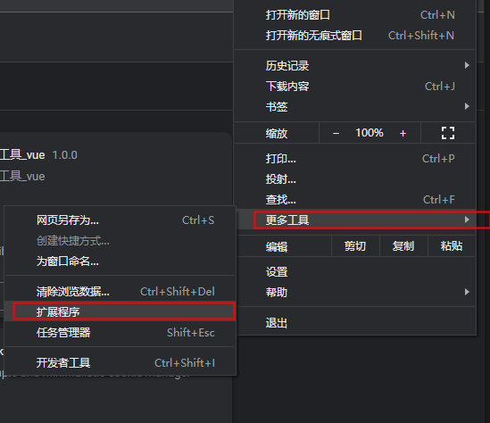
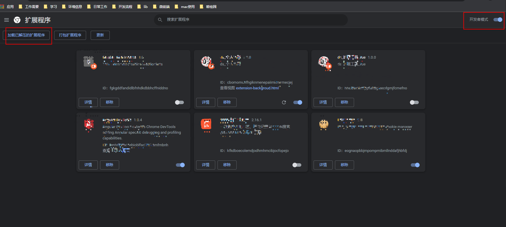
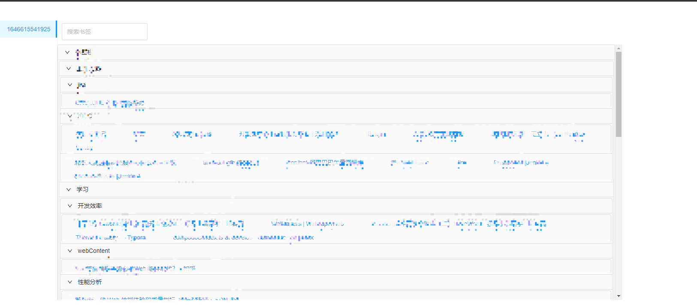
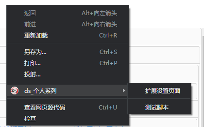
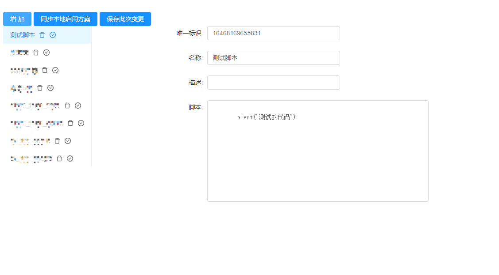
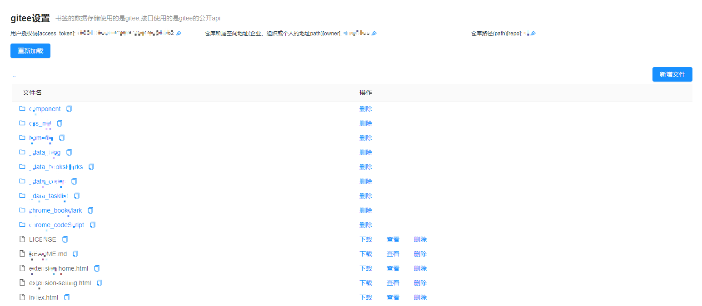

# chrome插件

## 功能
1. 重写书签页，实现书签页的多电脑同步功能
2. 实现脚本快捷执行功能，应用场景：快捷登录
3. 快捷便签功能
4. 本chrome插件的管理后台
5. gitee仓库文件管理功能
6. 博客管理功能(未开发完全)


## 扩展初始化

基于dsn系列的脚手架进行初始化

### 安装方式

```
1. 安装了node, 在控制台中执行如下命令
2. npm install dfb -g
3. dsn dg -chrome
```

最后会打印出扩展的下载地址，然后在chrome扩展中加载已解压的文件夹即可；操作如下







### 前置条件

#### 使用开发者提供的公共gitee仓库

```
1. 用户授权码: 16cf2bb0ab7fa12779bfec47f2c3ee9a
2. 仓库所属空间地址: semonstrate
3. 仓库路径: demonstrate_storage
```

#### 使用自己的gitee仓库

1. 登录码云, 这个能获取到仓库所属空间地址
2. 新建一个自己的仓库, 这个能获取到仓库路径
3. 获取私人令牌, 这个能获取到用户授权码

### 书签功能

#### 重写的书签页

1. 使用的是antDesign风格的折叠面板展示自己的书签页





2. 书签设置页，设置储存书签的gitee令牌信息


3. 书签管理页，可以删除储存的书签信息

### 脚本快捷执行

1. 右击快捷执行脚本




2. 脚本管理，进行脚本的增删改查及启用禁用




### gitee文件管理

1. 文件管理，进行上传和删除功能



