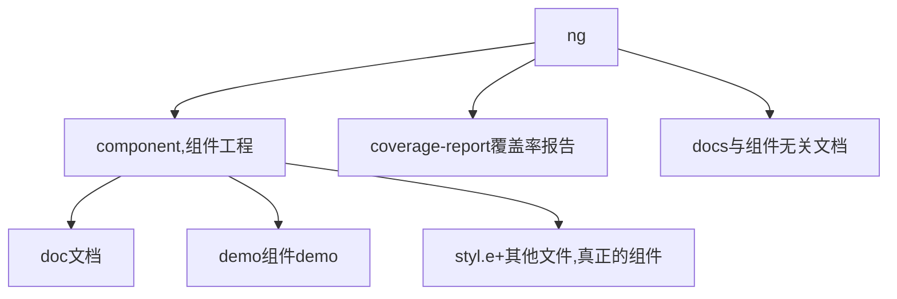
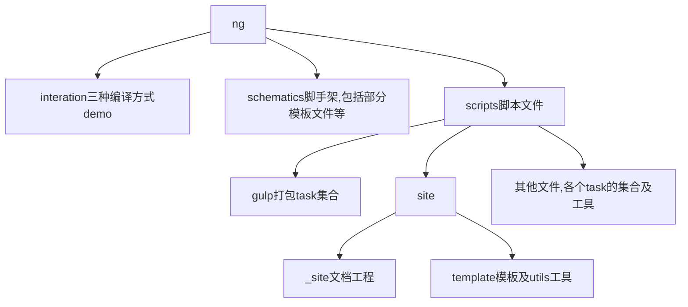
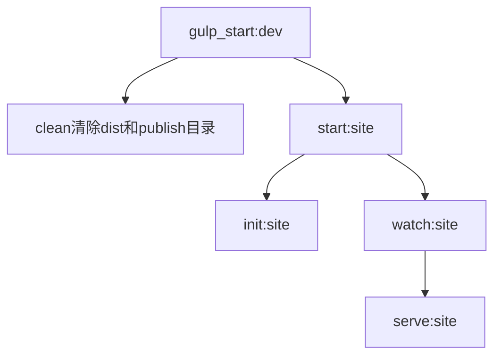
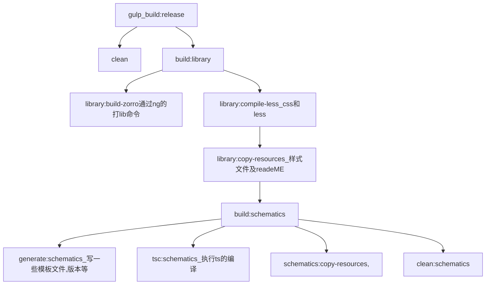

# Ant Design（ng9）


## 目录结构

<div style="backgroud: #000">
    
</div>

### component目录

<div style="backgroud: #000">
    
</div>

此目录总分为三块： 组件,文档,示范代码(demo)
1. 组件：       
    a. 还是ng的module结构,以public-api.ts+index.ts为导出口,样式文件卸载style文件夹,以一个组件为一个module,这样易于后来的按需加载.        
    b. 存在一个core的目录，主要是service,在每个组件module按需引入service,保证组件module的整洁.      
    c. 测试文件以每一个测试用例为主体,没有写个测试文件,只是了解,不熟悉,其中大量的是一个issue为一个测试用例

2. 文档： 
    以头部写入文档的信息,为以后的打包做指引

```md
---
category: Components
subtitle: 固钉
type: 导航
title: Affix
---

文档内容

```

3. 示范代码： 
   以正常的组件代码及md文件做为一个示范例子其实是一个module,但是其打包的特性,将module写未无后缀的文件

### docs目录

 就是普通的md文档目录,包括中英文,主要是写总体介绍,使用方式等文档,不于实际组件挂钩

 ### integration目录

<div style="backgroud: #000">
    
</div>


如上图,应该是打包angular工程打包的三种方式. 在源码工程内都是测试例子.       
例如angular_cli脚手架工具,去掉了大量的测试及一些文件,appcomponent内只有一个测试按钮.        
webpack工具,去掉了angular.json,以webpack.config.js文件为主,其余文件都与上述工具相同,现在不知原理,       
rollup不懂,估计和webpack差不多      

筒体来说这个文件只是单纯的测试angular工程的打包

### schematics目录

<div style="backgroud: #000">
    
</div>

ant Design的脚手架工具源码,其readeMe.md有详细介绍,主要是其构建,调试,发布的命令;其中还包含整个antDesign官网除组件及文件部分的代码,其作用类似于layout(整体网站架构)

### scripts 目录

<div style="backgroud: #000">
    
</div>

打包antDesign官网的工具,代码格式检查工具,工程构建工具,就相于把组件里面的三大部分分别塞入整体的网站架构中去.


### site目录

<div style="backgroud: #000">
    
</div>

以gulp打包的两个工程,一个doc工程,一个iframe工程, iframe工程并没有用的,主要是doc工程,就是antDesign的官网,其中每个组件都生成了一个页面（ng组件）


# 构建思路：

1. 【简单, 目录分散】以node+ 前端工程两个(demo+组件工程及文档工程)，其中node负责做为静态服务器及处理md文件请求,文档工程通过demo目录生成架构, 其中中有ifrme,每个组件demo有一个url, 引入生成文档网站，所有组件在组件工程一个目录,写node代码处理最后的打包及上传。【文档工程脱离组件工程架构,可用各个框架】

2. 【工具打包,难,工具不熟】,以node写命令,使用打包工具,模仿ant design,针对性太强,ng就是ng的,技术点多,维护难度高.整体架构强,生成的浏览网站流畅度高,组件代码文档集中,目录清晰明了.


# 文件架构图




1. component,组件工程ng g libaray ng-zorro-antd生成加修改的              
2. coverage-report覆盖率报告 就是由ng test修改生成的                
3. publish发布的包实际就是由ng build ng-zorro-antd修改生成的                
4. site中的_site文档工程实际就是一个空的ng工程，由task读取component组件工程生成各个文件              





1. watch:site 此命令主要是执行scripts下面的scipts下面的site文件夹，在里面有一个_site的文档工程，通过读写文件的方式将各个组件写入，并且通过分隔md文件，将组件demo放到中间，排序由demo的文档头信息提供




# 源码解析之编译篇

1: 使用的是glup     
2: ts-node: 编译ts的库      
3: 开始运行     
4: 清除之前编译的文件       
5:      
6: demo文件，必须是一个ts配合一个md,分解文件逻辑就是按照md文件名作为demo名      
【知识点】      
1: gulp.src(glop,{option}); 使用node-glob实现匹配; option.read, option.allowEmpty       
2: gulpClean: 删除目录的库      
3: series()同步操作， parallel() 异步操作       
4: yaml-front-matter  操作md文件库，去头部元信息        
5: remark  markDown解析文件库       
6: detect-port  端口检测器      